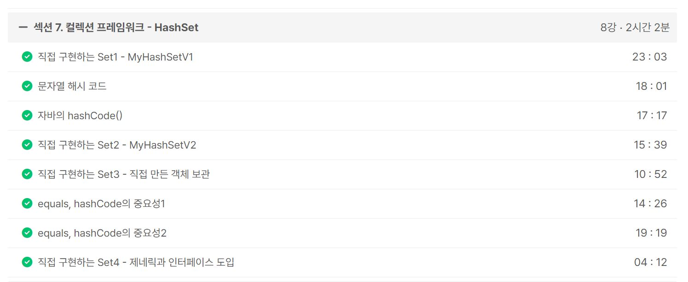
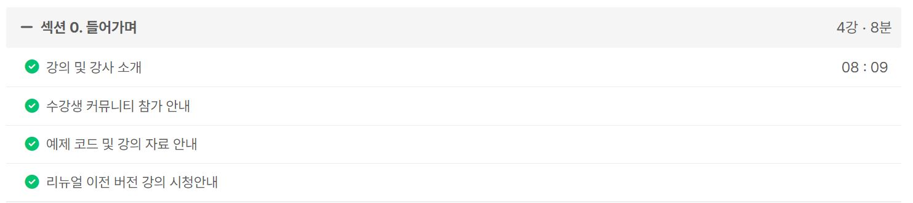
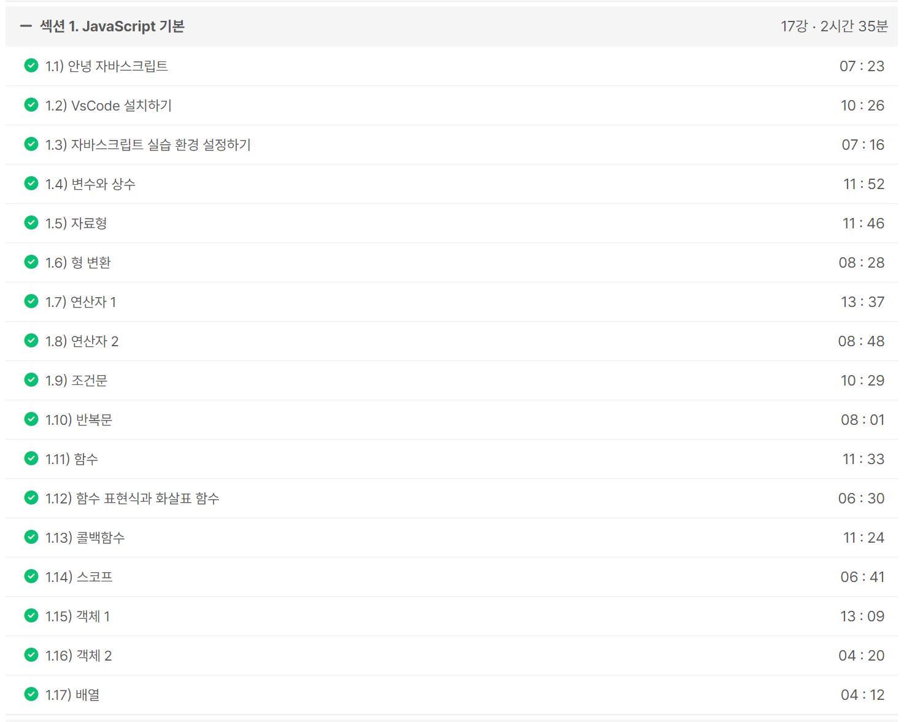

### (완료) 3. 알고리즘 카테고리로 포스팅 7개 작성하기

- https://mwzz6.tistory.com/entry/%EB%B0%B1%EC%A4%80-17386%EB%B2%88-%EC%84%A0%EB%B6%84-%EA%B5%90%EC%B0%A8-1-Java
- https://mwzz6.tistory.com/entry/%EB%B0%B1%EC%A4%80-2696%EB%B2%88-%EC%A4%91%EC%95%99%EA%B0%92-%EA%B5%AC%ED%95%98%EA%B8%B0-Java
- https://mwzz6.tistory.com/entry/%EB%B0%B1%EC%A4%80-4195%EB%B2%88-%EC%B9%9C%EA%B5%AC-%EB%84%A4%ED%8A%B8%EC%9B%8C%ED%81%AC-Java
- https://mwzz6.tistory.com/entry/%EB%B0%B1%EC%A4%80-2921%EB%B2%88-%EB%8F%84%EB%AF%B8%EB%85%B8-Java
- https://mwzz6.tistory.com/entry/%ED%94%84%EB%A1%9C%EA%B7%B8%EB%9E%98%EB%A8%B8%EC%8A%A4-42861%EB%B2%88-%EC%84%AC-%EC%97%B0%EA%B2%B0%ED%95%98%EA%B8%B0-Java
- https://mwzz6.tistory.com/entry/%EB%B0%B1%EC%A4%80-11404%EB%B2%88-%ED%94%8C%EB%A1%9C%EC%9D%B4%EB%93%9C-Java
- https://mwzz6.tistory.com/entry/%EB%B0%B1%EC%A4%80-11780%EB%B2%88-%ED%94%8C%EB%A1%9C%EC%9D%B4%EB%93%9C-2-Java

ref : https://github.com/FickleBoBo/Tistory/tree/master/2024-07/src/day_13

---

### (완료) 2. Inflearn : 김영한의 실전 자바 - 중급 2편

- 섹션 7. 컬렉션 프레임워크 - HashSet (2h 2m)

추가로 공부해볼 점

- 이펙티브 자바 equals와 hashCode 메서드의 오버라이딩 파트
- 해시 함수의 효율적인 해싱 원리
- 해시 충돌에 대한 대책 알고리즘
- 자바의 해시 충돌 알고리즘(개별 체이닝 방식) 및 링크드리스트와 레드블랙트리를 통한 해시 충돌 관리
- 로드팩터와 리해싱

ref : https://github.com/FickleBoBo/Inflearn

---

### 6630 알고리즘 스터디

- 07/18 스터디 자료 업로드

ref : https://github.com/Dohyungh/6630_Algorithm_study/tree/master/Calender/07_18_thu

---

### (진행) 1. Inflearn : [2024] 한입 크기로 잘라 먹는 리액트(React.js) : 기초부터 실전까지

- 섹션 0. 들어가며 (8m)
- 섹션 1. JavaScript 기본 (2h 35m)

ref : https://github.com/FickleBoBo/Inflearn

---
