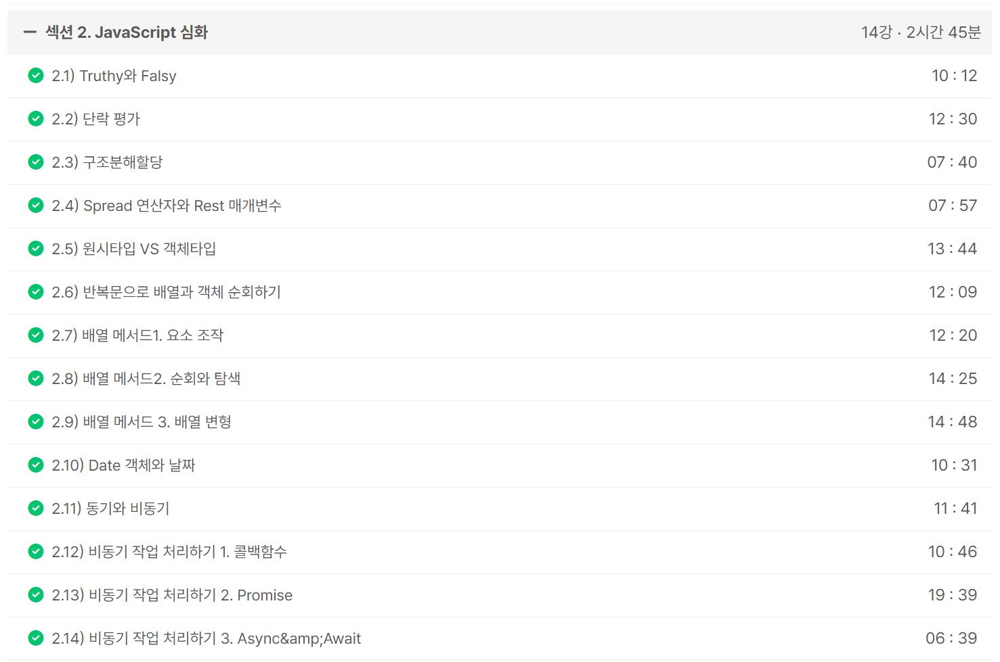
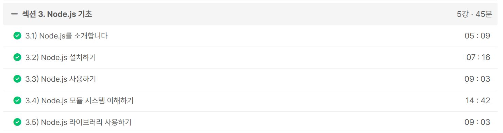

### 일일 알고리즘 문제 풀이

- https://www.acmicpc.net/problem/11758

생각해볼 점

- CCW가 좀 익숙해졌으니 Graham's scan 알고리즘 문제도 하나 정도 시도해보면 좋을 것 같다
- 좌표로 주어진 다각형의 넓이를 구하는 문제를 CCW로 해결할 수 있을 것 같다

ref : https://github.com/FickleBoBo/Algorithm_WorkSpace/tree/master/month_07/src/day_14

---

### 알고리즘 카테고리로 포스팅 1개 작성

- https://mwzz6.tistory.com/entry/%EB%B0%B1%EC%A4%80-11758%EB%B2%88-CCW-Java

ref : https://github.com/FickleBoBo/Tistory/tree/master/2024-07/src/day_14

---

### (실패) 1. Inflearn : [2024] 한입 크기로 잘라 먹는 리액트(React.js) : 기초부터 실전까지

- 섹션 2. JavaScript 심화 (2h 45m)
- 섹션 3. Node.js 기초 (45m)

ref : https://github.com/FickleBoBo/Inflearn

---
