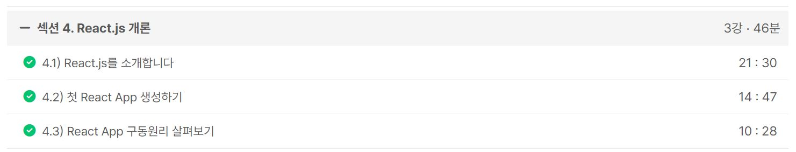
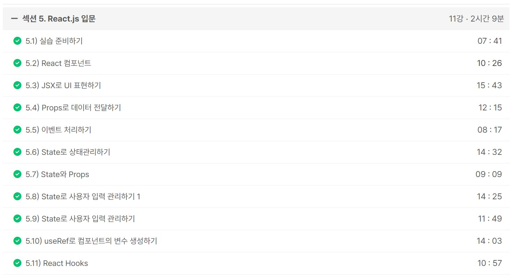

### 일일 알고리즘 문제 풀이

- https://www.acmicpc.net/problem/1655

6630 알고리즘 스터디 07/11 도형이형 문제였던 중앙값 구하기와 매우 유사한 문제였다.
도형이형 문제는 홀수번째마다 출력하는 것이고 이 문제는 짝수번째도 출력하는 것인데 사실상 논리는 동일한 문제였다.

ref : https://github.com/FickleBoBo/Algorithm_WorkSpace/tree/master/month_07/src/day_15

---

### more-effective-java 스터디 탐구 업로드

- 사용자 정의 예외를 통한 매개변수 유효성 검사에 관한 글 작성
- 개념 자체는 간단한 내용이었으며 디버깅을 도와주는 개념에 가깝다고 생각했다.
- Custom Exception에 대한 학습과 적절한 예외 처리 기법에 대한 학습이 추가로 필요할 것 같다.

ref : https://github.com/glenn-syj/more-effective-java/pull/194

---

### Inflearn : [2024] 한입 크기로 잘라 먹는 리액트(React.js) : 기초부터 실전까지

- 섹션 4. React.js 개론 (46m)
- 섹션 5. React.js 입문 (2h 9m)

useState와 useRef까지 개념적으로 학습했고, 이제는 ChatGPT만 있으면 Vue 프로젝트를 React로 리팩토링도 해볼만한거 같다.
React가 Vue보다 자율성이 높다는게 약간 공감됐고, React 프로젝트를 아직 시작하지는 않았는데 재밌을 것 같다.

ref : https://github.com/FickleBoBo/Inflearn

---
