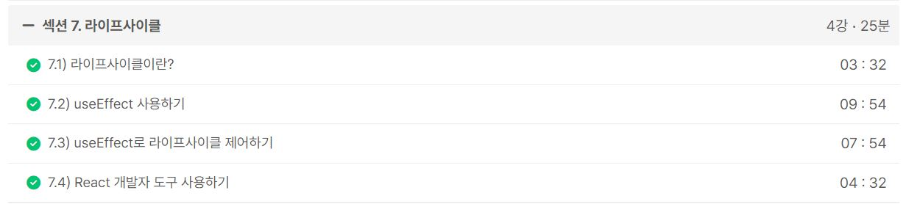
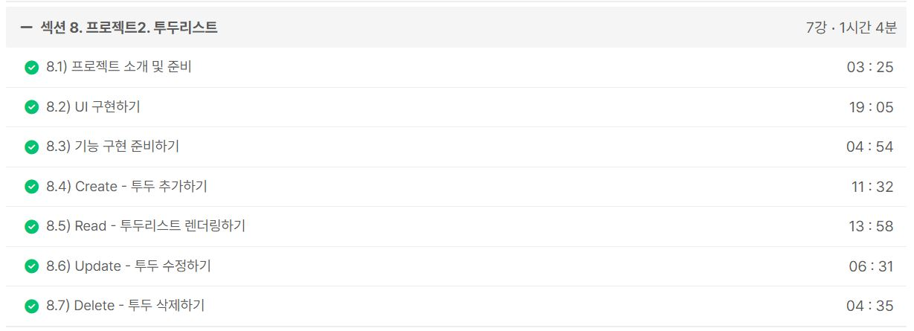
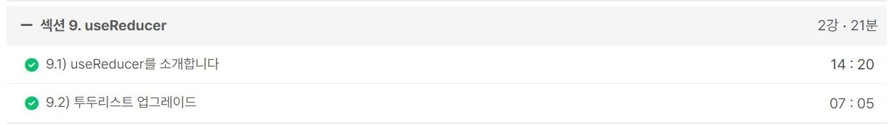
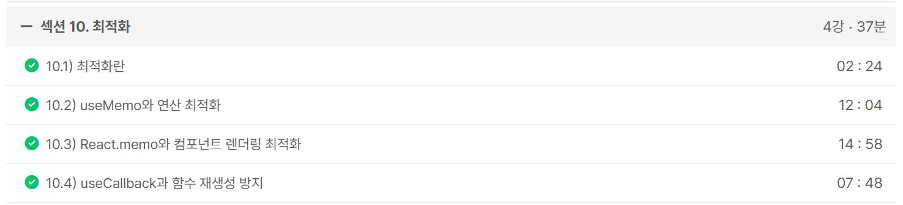
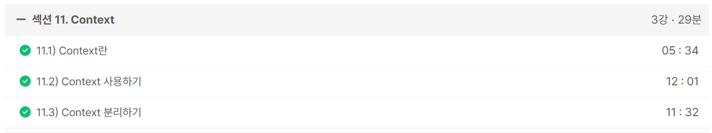

### 일일 알고리즘 문제 풀이

https://www.acmicpc.net/problem/1781

- 6630 알고리즘 스터디 07/11일 개인 문제로 준비해간 보석 도둑이라는 문제가 있는데, 그 문제를 풀면서 이 컵라면 문제가 동일한 논리로 해결할 수 있을 것 같았다. 이 문제가 약간 더 어려운데 거의 비슷하게 해결할 수 있다.

https://www.acmicpc.net/problem/2738

- 손이나 풀겸 쉬운거 한문제 풀었다.

ref : https://github.com/FickleBoBo/Algorithm_WorkSpace/tree/master/month_07/src/day_16

---

### 알고리즘 카테고리로 포스팅 1개 작성

https://mwzz6.tistory.com/entry/%EB%B0%B1%EC%A4%80-2738%EB%B2%88-%ED%96%89%EB%A0%AC-%EB%8D%A7%EC%85%88-Java

- 아주 간단한 구현 문제로 모듈러 연산과 복합대입연산자로 한번에 두 개의 행렬을 입력받을 수 있다.
- 가독성과 효율성면에서는 오히려 좋지 않다고 생각한다.

ref : https://github.com/FickleBoBo/Tistory/tree/master/2024-07/src/day_16

---

### 리액트 딥 다이브 스터디

- 책이 생각보다 많이 어렵다고 느꼈다.
- 이번주는 자세히 설명하기 시간도 부족하고 내용도 애매했는데, 다음주 리액트 훅 파트에서는 잘 준비해가야겠다.

---

### 1. Inflearn : [2024] 한입 크기로 잘라 먹는 리액트(React.js) : 기초부터 실전까지

- 섹션 6. 프로젝트1. 카운터 앱 (23m)
- 섹션 7. 라이프사이클 (25m)
- 섹션 8. 프로젝트2. 투두리스트 (1h 4m)
- 섹션 9. useReducer (21m)
- 섹션 10. 최적화 (37m)
- 섹션 11. Context (29m)

- 내일 감정 일기장 프로젝트로 라우팅까지 학습하면 진짜 Vue처럼 리액트 프로젝트를 할 수 있을 것 같다.
- 완강하고 justand 사용 이유 및 서버 요청 응답에 대해 찾아봐야겠다.

ref : https://github.com/FickleBoBo/Inflearn

---
