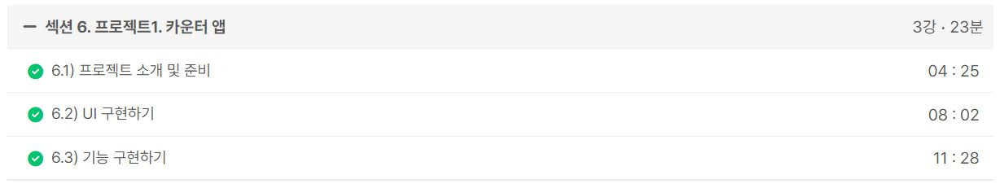

### 일일 알고리즘 문제 풀이

https://www.acmicpc.net/problem/1781

- 6630 알고리즘 스터디 07/11일 개인 문제로 준비해간 보석 도둑이라는 문제가 있는데, 그 문제를 풀면서 이 컵라면 문제가 동일한 논리로 해결할 수 있을 것 같았다. 이 문제가 약간 더 어려운데 거의 비슷하게 해결할 수 있다.

ref : https://github.com/FickleBoBo/Algorithm_WorkSpace/tree/master/month_07/src/day_16

---

### 1. Inflearn : [2024] 한입 크기로 잘라 먹는 리액트(React.js) : 기초부터 실전까지

- 섹션 6. 프로젝트1. 카운터 앱 (23m)
- 섹션 7. 라이프사이클 (25m)
- 섹션 8. 프로젝트2. 투두리스트 (1h 4m)
- 섹션 9. useReducer (21m)

ref : https://github.com/FickleBoBo/Inflearn

---
