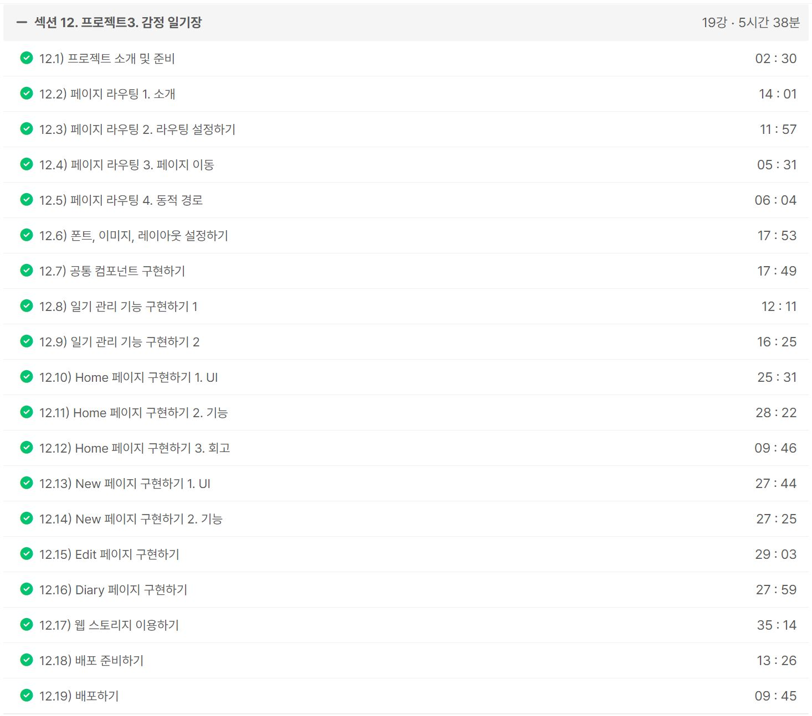
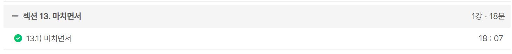

### 일일 알고리즘 문제 풀이

https://www.acmicpc.net/problem/1269

- 백준 게리맨더링 문제를 풀 때 두 리스트의 차집합을 구하는 것이 어려웠는데 마침 비슷한 문제인가 해서 풀어봤다.
- 훨씬 간단한 문제였고, 오히려 수학 유형에 가까운 것 같았다.

ref : https://github.com/FickleBoBo/Algorithm_WorkSpace/tree/master/month_07/src/day_17

---

### (성공) 1. Inflearn : [2024] 한입 크기로 잘라 먹는 리액트(React.js) : 기초부터 실전까지

- 섹션 12. 프로젝트3. 감정 일기장 (5h 38m)
- 섹션 13. 마치면서 (18m)

- 한입 리액트 드디어 완강했는데 강의 구성이 꽤 괜찮은 것 같다.
- 버그인지 오픈 그래픽이 적용이 안된다.
- Vue는 프레임워크 React는 라이브러리라는게 공감되는 학습이었고 초보자에게 진입 장벽은 좀 있는 느낌인데 개발 자유도가 높은 느낌이라 재미는 더 있는 것 같다.
- 리액트는 자바스크립트 피지컬이랑 상태관리가 전부인 것 같다

ref : https://github.com/FickleBoBo/Inflearn

---
