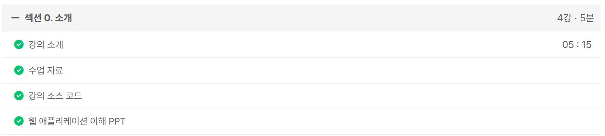
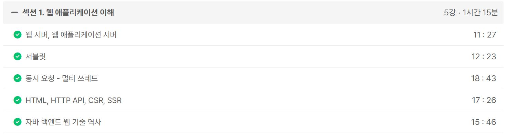

### 6630 알고리즘 스터디 문제 풀이 준비

[공통] https://www.acmicpc.net/problem/1846

- 공통 문제로 처음엔 N-Queen 같은 재귀 + 백트래킹 유형인 줄 알았는데 N의 범위가 살벌하기도 하고, 배치를 하나만 찾으면 되기도 하고, 배치가 뭔가 규칙성이 있어보여서 간단하게 해결할 수 있었다. 개발 공부를 안했으면 오히려 더 빨리 풀 수 있었을 것 같은 느낌이었다.

[성진] https://school.programmers.co.kr/learn/courses/30/lessons/67258

- 성진이가 가져온 개인 문제로 생각보다 난이도가 약간 있었다.
- 딱보고 투 포인터 같았는데 구현이 빡셀거 같아서 그냥 2중 for문에 백트래킹으로 해볼까 했는데 역시 광탈
- 어거지로 투 포인터하니까 효율성 테스트까지 통과는 됐는데 쉽지는 않은 문제였다.

[민우] https://www.acmicpc.net/problem/11780

- 플로이드 문제 업글 버전으로 최단 거리 + 최단 경로를 구해야 한다
- 플로이드는 딱 이정도까지만 할 수 있으면 충분한 것 같다
- 최단 경로를 구하는 매커니즘이 생각보다 쉽지는 않아서 여유가 되면 손풀이를 해봐도 좋을 거 같다

[공통] https://www.acmicpc.net/problem/16985

- 공통 문제로 구현이 빡센 유형이었던 것 같다
- 순열, 중복순열, 배열 회전, BFS 종합선물세트였는데 중복 계산이 많아서 최적화를 해봤는데 시간 단축이 안됐다.
- 500ms 이내로 푼 풀이가 좀 있었는데 읽기 복잡해서 스터디에서 다른 풀이가 있는지 확인해야겠다.

ref : https://github.com/Dohyungh/6630_Algorithm_study/tree/master/Calender/07_25_thu

---

### (성공) 3. 알고리즘 카테고리로 포스팅 7개 작성하기

https://mwzz6.tistory.com/entry/%EB%B0%B1%EC%A4%80-5648%EB%B2%88-%EC%97%AD%EC%9B%90%EC%86%8C-%EC%A0%95%EB%A0%AC-Java

- 자바는 확실히 문자열 다루기가 피곤하다
- StringBuilder의 reverse()를 통해 간단하게 해결도 가능한데 IDE의 도움없이 사용하기는 쉽지 않을듯

https://mwzz6.tistory.com/entry/%EB%B0%B1%EC%A4%80-10825%EB%B2%88-%EA%B5%AD%EC%98%81%EC%88%98-Java

- 아주 쉬운 문제
- 정렬 문제에서 정렬 결과가 한번만 필요하면 우선순위 큐와 배열 정렬 중 뭐가 효율적인지 고민이 필요해보임

https://mwzz6.tistory.com/entry/%EB%B0%B1%EC%A4%80-7795%EB%B2%88-%EB%A8%B9%EC%9D%84-%EA%B2%83%EC%9D%B8%EA%B0%80-%EB%A8%B9%ED%9E%90-%EA%B2%83%EC%9D%B8%EA%B0%80-Java

- 이전에는 O(N²) 풀이로 했던 걸 이제는 투 포인터로 O(N) 컷 낼 수 있어졌다.
- 앞에서부터 투 포인터를 적용하는건 자꾸 답이 잘 안나와서 뒤에서부터 돌렸는데 근본적인 차이가 없는거 같은데 잘 안됐음

https://mwzz6.tistory.com/entry/%EB%B0%B1%EC%A4%80-1781%EB%B2%88-%EC%BB%B5%EB%9D%BC%EB%A9%B4-Java

- 전에는 어려워서 못 풀었던 문제였는데 보석 도둑 문제를 알고리즘 스터디 문제로 준비할 때 딱 이 문제랑 똑같은 원리인걸 알았다.
- 그래도 이 문제가 더 어려운데 데드라인이 먼 문제를 먼저 푸는 역방향 그리디를 적용해야하는 아이디어를 떠올리기가 쉽지는 않다.

https://mwzz6.tistory.com/entry/%EB%B0%B1%EC%A4%80-1655%EB%B2%88-%EA%B0%80%EC%9A%B4%EB%8D%B0%EB%A5%BC-%EB%A7%90%ED%95%B4%EC%9A%94-Java

- 도형이 형이 준비한 중앙값 문제랑 똑같다.
- 우선순위 큐를 활용하는 아이디어는 참신한 문제

https://mwzz6.tistory.com/entry/%EB%B0%B1%EC%A4%80-13300%EB%B2%88-%EB%B0%A9-%EB%B0%B0%EC%A0%95-Java

- 귀여운 티어와 달리 약간은 까다로운 문제로 몫과 나머지를 활용해서 방의 개수를 정확히 구하는데 실수할 여지가 있다.
- 한 줄 로직으로 처리하는건 어려울거 같아서 두 줄로 나눠서 처리했다.

https://mwzz6.tistory.com/entry/%EB%B0%B1%EC%A4%80-3273%EB%B2%88-%EB%91%90-%EC%88%98%EC%9D%98-%ED%95%A9-Java

- 투 포인터 알고리즘 대표 유형으로 선형 자료구조에서 투 포인터를 적용할 때 양 끝에서 가운데로 투 포인터를 적용해야하는 점을 캐치하는게 핵심인 문제
- 투 포인터랑 정렬은 세트인 것 같다

ref : https://github.com/FickleBoBo/Tistory/tree/master/2024-07/src/day_20

---

### more-effective-java 스터디 이슈 작성

- Collection과 Iterable, 향상된 for문에 대한 이슈 작성
- 여유가 되면 Iterable의 내부 구조와 Stream이 Iterable을 확장하지 않는 이유에 대해 학습해도 좋을 것 같다

ref : https://github.com/glenn-syj/more-effective-java/issues/196

---

### Inflearn : 스프링 MVC 1편 - 백엔드 웹 개발 핵심 기술

공부할게 많아서 스프링과 JPA는 일단 눈에 먼저 바르고 손 코딩을 진행할 예정

- 섹션 0. 소개 (5m)
- 섹션 1. 웹 애플리케이션 이해 (1h 15m)

ref : https://github.com/FickleBoBo/Inflearn/blob/master/%EC%9D%B8%ED%94%84%EB%9F%B0.xlsx

---
