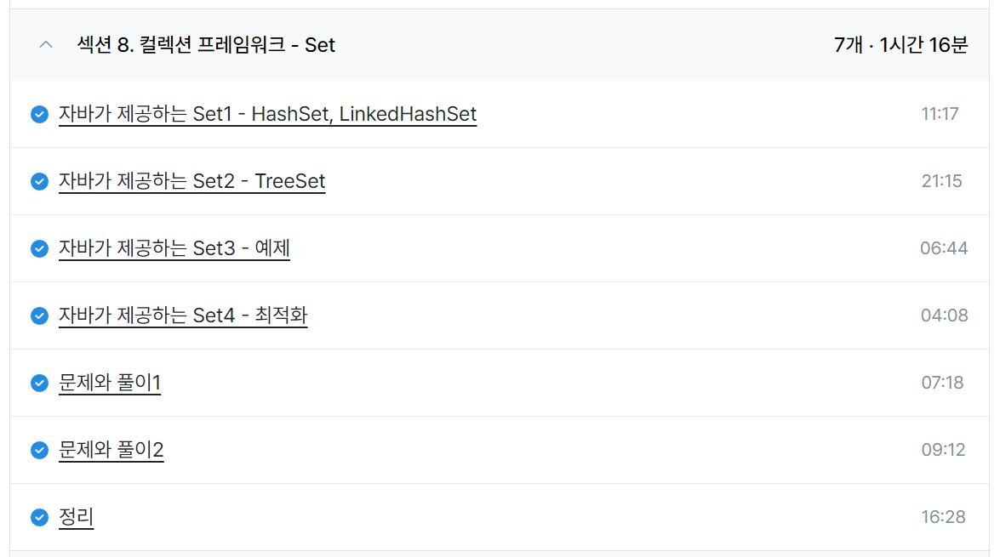

### 일일 알고리즘 학습 및 블로그 업로드

머리 식힐 겸 간단한 문제들 풀이 및 정리

https://www.acmicpc.net/problem/10818

https://mwzz6.tistory.com/entry/%EB%B0%B1%EC%A4%80-10818%EB%B2%88-%EC%B5%9C%EC%86%8C-%EC%B5%9C%EB%8C%80-Java

https://www.acmicpc.net/problem/5597

https://mwzz6.tistory.com/entry/%EB%B0%B1%EC%A4%80-5597%EB%B2%88-%EA%B3%BC%EC%A0%9C-%EC%95%88-%EB%82%B4%EC%8B%A0-%EB%B6%84-Java

https://www.acmicpc.net/problem/10871

https://mwzz6.tistory.com/entry/%EB%B0%B1%EC%A4%80-10871%EB%B2%88-X%EB%B3%B4%EB%8B%A4-%EC%9E%91%EC%9D%80-%EC%88%98-Java

https://www.acmicpc.net/problem/2562

https://mwzz6.tistory.com/entry/%EB%B0%B1%EC%A4%80-2562%EB%B2%88-%EC%B5%9C%EB%8C%93%EA%B0%92-Java

https://www.acmicpc.net/problem/10813

https://mwzz6.tistory.com/entry/%EB%B0%B1%EC%A4%80-10813%EB%B2%88-%EA%B3%B5-%EB%B0%94%EA%BE%B8%EA%B8%B0-Java

https://www.acmicpc.net/problem/3052

https://mwzz6.tistory.com/entry/%EB%B0%B1%EC%A4%80-3052%EB%B2%88-%EB%82%98%EB%A8%B8%EC%A7%80-Java

https://www.acmicpc.net/problem/1546

https://mwzz6.tistory.com/entry/%EB%B0%B1%EC%A4%80-1546%EB%B2%88-%ED%8F%89%EA%B7%A0-Java

ref : https://github.com/FickleBoBo/Algorithm_WorkSpace/tree/master/month_07/src/day_26

ref : https://github.com/FickleBoBo/Tistory/tree/master/2024-07/src/day_26

---

### Inflearn : 김영한의 실전 자바 - 중급 2편

- 섹션 8. 컬렉션 프레임워크 - Set (1h 16m)

- 해시셋, 링크드해시셋, 트리셋에 대한 개념을 간단하게 익힐 수 있었다.
- 해시 계열 자료구조에서 해시 충돌 발생에 대해 링크드 리스트를 활용한 개별 체이닝 방식을 적용하다가 체인의 길이가 8 이상이 되면 트리 구조로 바뀌는건 알았는데, 이 트리구조가 레드블랙트리를 사용한 트리셋으로 구현된 것은 처음 알았다.
- 링크드해시셋의 경우 사용해본 적은 없지만 순서에 대한 데이터가 필요하면 input 대비 output이 뛰어난 자료구조인 것 같다.
- equals와 hashCode 메서드의 오버라이딩도 해시 충돌 상황을 가정하며 참조 값이 다른 객체가 같은 해시값을 가져야 한다는 점과 해시값이 같아도 내가 찾는 객체가 맞는지 비교해야한다는 점에서 이해할 수 있었다.
- 리해싱의 경우 배열의 75% 이상 사용될 경우 배열의 길이를 2배로 늘리고 모든 원소들의 해시값을 다시 구해서 배치한다고만 나왔는데, 이 경우에 대한 시간적 손실에 대해서는 슬쩍 넘어가서 약간 아쉬웠다. 추가 학습이 필요할 것 같다.

ref : https://github.com/FickleBoBo/Inflearn/tree/master/Java_04.%20%EA%B9%80%EC%98%81%ED%95%9C%EC%9D%98%20%EC%8B%A4%EC%A0%84%20%EC%9E%90%EB%B0%94%20-%20%EC%A4%91%EA%B8%89%202%ED%8E%B8

---

정보처리시가 실기 기출 문제 풀이

2023년 1회 기출(24점)

1. 자바스크립트 및 XML을 비동기 방식으로 처리하며, 전체 페이지를 새로 고치지 않고도 웹 페이지 일부 영역만을 업데이트할 수 있도록 하는 기술은 AJAX
2. 데이터 교환 방식에서 연결형 통신에서 주로 사용하며 출발지와 목적지의 전송 경로를 미리 연결하여 논리적으로 고정한 후 통신하면 가상 회전 방식, 비연결형 통신에서 주로 사용되는 방식으로, 사전에 접속 절차를 수행하지 않고 헤더에 출발지에서 목적지까지의 경로 지정을 위한 충분한 정보를 붙여서 개별적으로 전달하는 방식은 데이터그램 방식
3. L2F의 기술적 장점들을 결합하여 만든 프로토콜은 L2TP
4. 다른 컴퓨터에 명령을 수행할 수 있으며 22번 포트를 기본적으로 사용하는 녀석은 SSH
5. 멀웨어에서 웜은 네트워크를 타고 스스로 전파 가능하고, 바이러스는 네트워크를 타고 스스로 전파가 불가능하다.
6. IP의 주요 구성원이면서 OSI 계층 모델의 네트워크 계층이면서, traceroute, ping과 관련있는 것은 ICMP
7. 디자인 패턴에서 대리자 키워드는 Proxy
8. 릴레이션을 구성하는 각각의 행은 튜플, 실제 값을 가진 튜플은 릴레이션 인스턴스, 튜플의 개수는 카디널리티
9. 파이썬에서 update는 !contains + addAll 느낌
10. 개념스키마는 데이터베이스의 전체적인 논리적 구조, 내부스키마는 물리적 순서, 외부스키마는 논리적 구조

---
