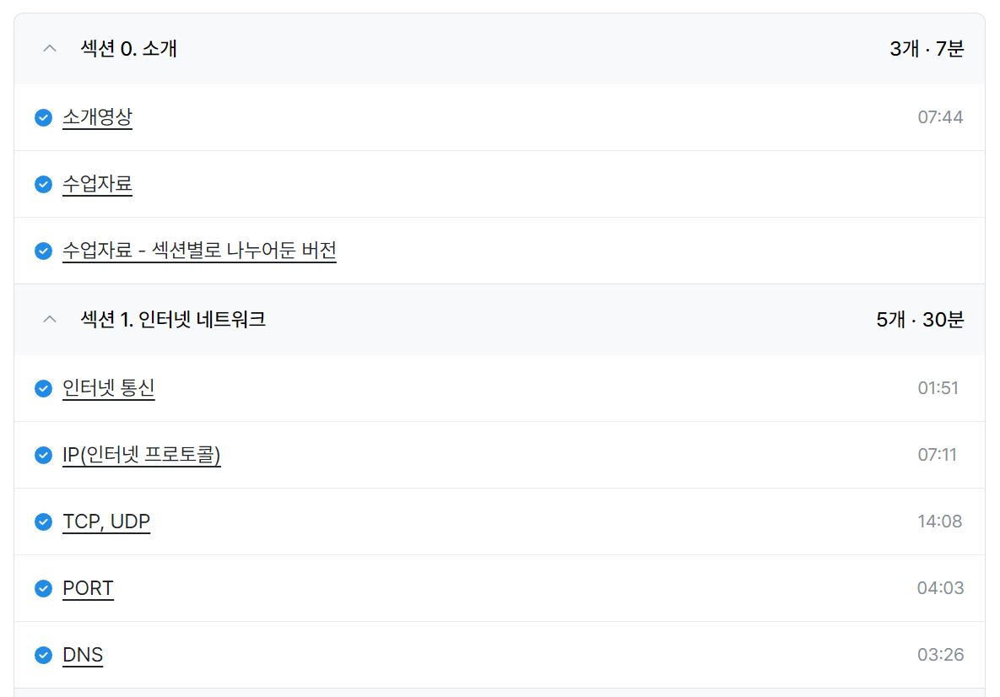
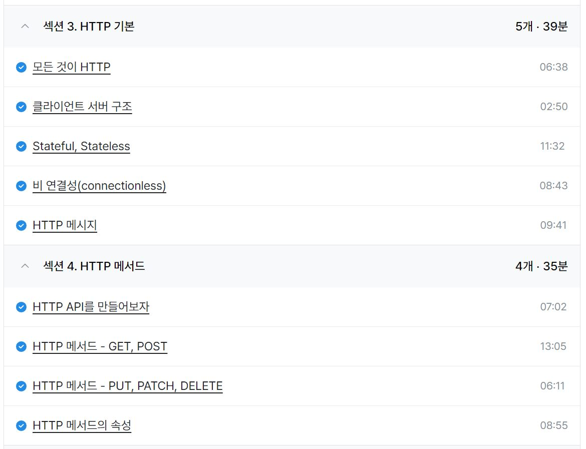
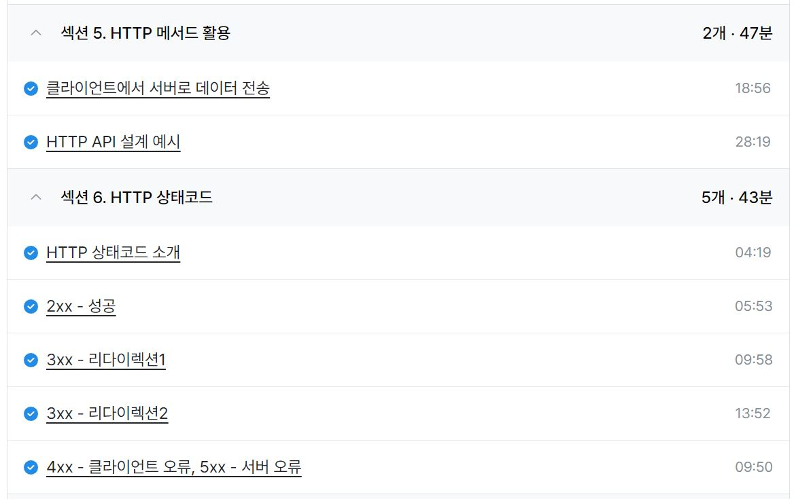

### 일일 알고리즘 문제 풀이

https://www.acmicpc.net/problem/10990

- 오늘 스트릭 채우기용 문제
- 오른쪽 별을 출력한 이후 같은 줄에는 공백을 더 출력하지 않아야 하는 점에 주의

ref : https://github.com/FickleBoBo/Algorithm_WorkSpace/tree/master/month_07/src/day_30

---

### 프로젝트 : 기업 검색 기능 구현 및 멘토 카드 리팩토링

- 어제 집에서 구현한 초성검색, 한글검색, 조사 붙이기, 영어 대소문자 통합 검색 기능을 프로젝트에 적용하는데 성공
- 멘토 카드 API와 JSON 데이터 수정한 것 기반으로 멘토 카드 컴포넌트 수정
- 회사 검색 페이지를 새로 만들면서 기존의 컴포넌트 네이밍과 라우팅 수정
- 유효하지 않은 url에 대한 에러페이지 라우팅 기능은 구현에 실패했는데 굳이 구현하지 않아도 되는 기능이기도 해서 그냥 넘어갈듯하다
- 회사 관련 컴포넌트에 전부 타입스크립트 적용

---

### 인프런 : 모든 개발자를 위한 HTTP 웹 기본 지식

- 백엔드와의 원활한 HTTP 통신을 위한 인프런 학습 진행
- 기초 지식이 조금 쌓인 상태로 들으니 이해가 아주 잘됐다.
- 프론트든 백이든 통신에 대한 이해가 기본인듯

---
