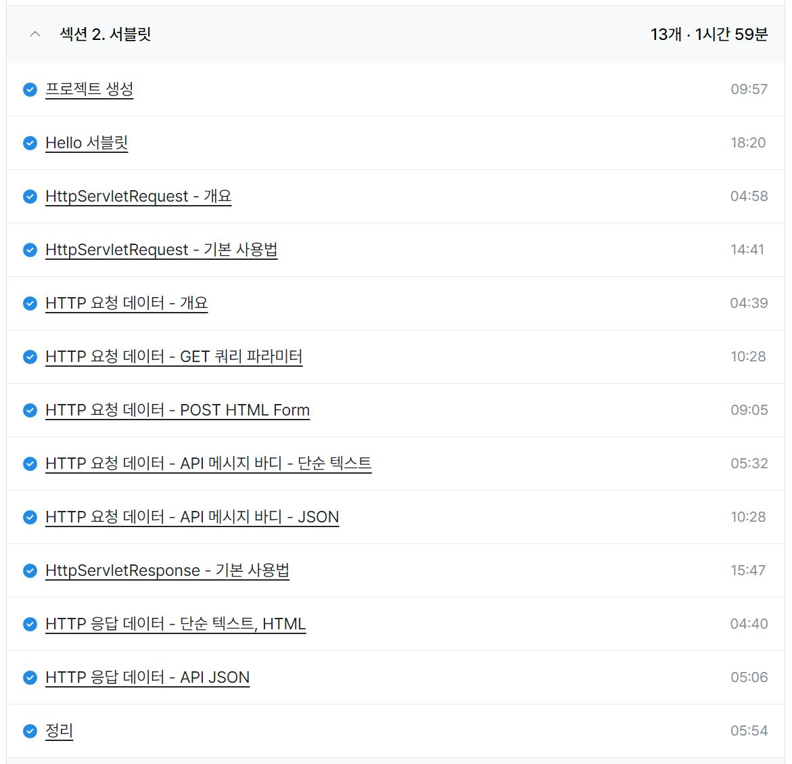

### 일일 알고리즘 학습 및 블로그 업로드

https://www.acmicpc.net/problem/10798

https://mwzz6.tistory.com/entry/%EB%B0%B1%EC%A4%80-10798%EB%B2%88-%EC%84%B8%EB%A1%9C%EC%9D%BD%EA%B8%B0-Java

- 막 자료구조를 학습할 시기에 도형이 형이 준비했던 큐 문제와 비슷한?똑같은? 문제였다.
- 입력 값의 최대 길이가 길지 않아서 그냥 배열로 해도 되기는 한데 큐 배열을 만들어서 해결해봤다.
- 입력 값을 바로 큐에 넣고 싶었는데 잘 모르겠어서 하나하나 반복문으로 넣었는데 컬렉션의 생성자에 넣을 수 있는 객체 타입에 대해 한번 정리해봐야겠다.

https://www.acmicpc.net/problem/2566

https://mwzz6.tistory.com/entry/%EB%B0%B1%EC%A4%80-2566%EB%B2%88-%EC%B5%9C%EB%8C%93%EA%B0%92-Java

- 아주 간단한 최댓값 찾기 문제로 스트릭 채우기 좋았다.

ref : https://github.com/FickleBoBo/Algorithm_WorkSpace/tree/master/month_08/src/day_01

ref : https://github.com/FickleBoBo/Tistory/tree/master/2024-08/src/day_01

---

### 프로젝트 : 풀스택 자유게시판 구현

- 어제 오늘 하루종일해서 CRUD까지 가능한 자유게시판을 풀스택으로 구현
- 처음에 HTTP 통신에 문제가 있어서 어려움이 있었는데 fake json 사이트를 통해 프론트파트를 통신까지 먼저 구현하고 이후 백엔드 파트를 구현해서 연결
- 게시글 상세 조회 페이지와 게시글 수정 페이지에서 새로고침 버튼을 누르면 request는 가는데 response에 데이터가 안담기는 이슈가 있었는데 하루종일 해도 해결이 안됐다.
- 두 페이지에서 새로고침 시 발생한 요청은 헤더에 엑세스 토큰이 안담겨서 서버에서 튕기는게 원인으로 파악되는데 커스텀 axios의 인터셉터가 문제일거라고 추측만 하고 있다.
- 해결 방안으로는 서버에서 게시판은 토큰 검증을 제외하도록 하거나 커스텀 axios를 수정해야할 것 같은데 사용자 인증에 따라 게시판에서 사용 가능한 기능에 제한을 둬야해서 커스텀 axios를 수정해야 할 것으로 보이는데 해당 파트를 구현한 팀원이 빠르게 해결할 수 있을지는 미지수다.
- 주말까지 서버측 코드를 JPA 포함 내 스타일로 리펙토링하고 데이터베이스와 연결하는게 일단 목표이고 가능하다면 검색과 추가 게시판까지 구현할 예정

---

### 인프런 - 스프링 MVC 1편 - 백엔드 웹 개발 핵심 기술

- 서블릿으로 구현하는 서버 파트여서 당장 적용할만한 내용은 아니었지만 자바로 구현하는 백엔드의 기본 동작 구조를 파악하기 좋은 파트였다.
- HTTP에 대한 이해와 백엔드의 기본 메커니즘에 대한 이해가 조금 생긴 이후에 들으니 재밌고 이해하기 쉬웠다.
- 아직 백엔드는 내가 원하는 데이터를 HTTP로 잘 전달하는 것과 request, response를 잘 다루는 것이 어려운데 이게 백엔드의 90% 인 것 같다.
- 강의 자체는 스프링 부트에서 html 정적 리소스도 같이 다루는 서버 사이드 렌더링 프로젝트여서 클라이언트 사이드 렌더링과의 차이에도 집중하면서 학습하면 더 얻어갈게 많을듯

---
