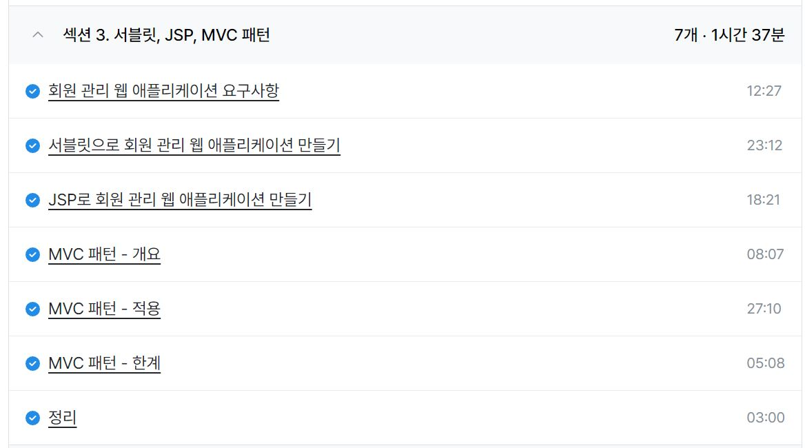
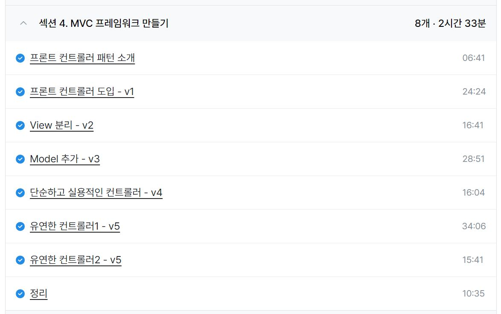
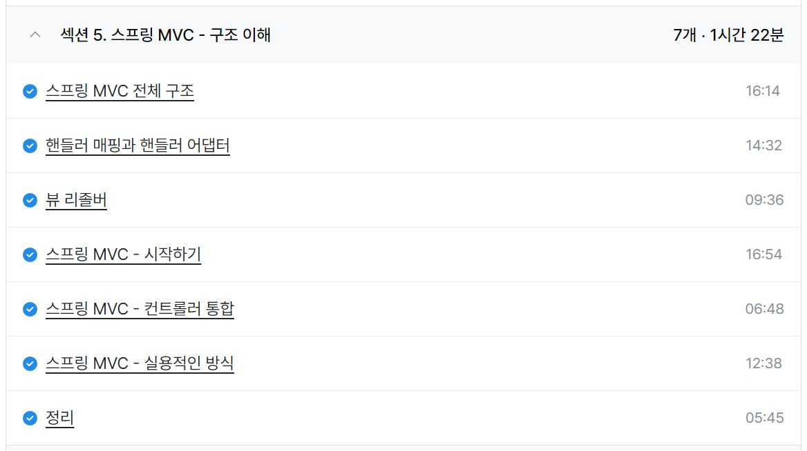
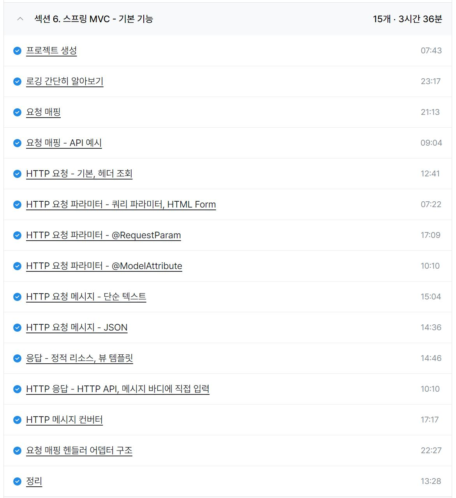

### 일일 알고리즘 학습 및 블로그 업로드

https://www.acmicpc.net/problem/5622

https://mwzz6.tistory.com/entry/%EB%B0%B1%EC%A4%80-5622%EB%B2%88-%EB%8B%A4%EC%9D%B4%EC%96%BC-Java

- 여름 방학 과제로 했었던 컬렉션의 개념을 적용하면 간단하게 해결할 수 있는 문제로 초기화 비용에 대한 손해화 참조 비용에 대한 트레이드 오프를 고민해볼만한 문제였던 것 같다.

https://www.acmicpc.net/problem/2744

https://mwzz6.tistory.com/entry/%EB%B0%B1%EC%A4%80-2744%EB%B2%88-%EB%8C%80%EC%86%8C%EB%AC%B8%EC%9E%90-%EB%B0%94%EA%BE%B8%EA%B8%B0-Java

- 알파벳의 아스키 코드가 연속된다는 점을 활용하면 간단하게 해결할 수 있는 문제로 A는 65, a는 97이라는 점은 암기가 필요해보인다.

https://www.acmicpc.net/problem/11654

https://mwzz6.tistory.com/entry/%EB%B0%B1%EC%A4%80-11654%EB%B2%88-%EC%95%84%EC%8A%A4%ED%82%A4-%EC%BD%94%EB%93%9C-Java

- 아스키 코드를 출력하는 간단한 문제로 char 타입의 문자를 int로 형변환해야 아스키 코드를 출력할 수 있다는 점에 주의해야 한다.

https://www.acmicpc.net/problem/10809

https://mwzz6.tistory.com/entry/%EB%B0%B1%EC%A4%80-10809%EB%B2%88-%EC%95%8C%ED%8C%8C%EB%B2%B3-%EC%B0%BE%EA%B8%B0-Java

- indexOf 메서드에 대해 알고 있는지 물어보는 문제로 자바 기본 내장 메서드에 대한 학습도 중요해보인다.

ref : https://github.com/FickleBoBo/Algorithm_WorkSpace/tree/master/month_08/src/day_03

ref : https://github.com/FickleBoBo/Tistory/tree/master/2024-08/src/day_03

---

### MEJ 이펙티브 자바 스터디 글 작성

- 가변인수 메서드와 관련된 파트에 대한 탐구 글 작성
- 가변인수 메서드를 활용하는 대표 예시라고 생각되는 printf, 정적 팩터리 메서드 of, main 세 가지에 대해 자바에서 어떻게 가변인수 메서드를 활용하는지 알아보는 방향으로 탐구 진행

ref : https://github.com/glenn-syj/more-effective-java/pull/204/commits/211d29f32195e94c8f53a0b25ebc909023ef563f?short_path=f380d20#diff-f380d20e5e56597107716a0e1738d9c60a2d9139465bf43934126784baacb5c3

---

### 인프런 - 스프링 MVC 1편 - 백엔드 웹 개발 핵심 기술

- 섹션 3. 서블릿, JSP, MVC 패턴 (1h 37m)
- 섹션 4. MVC 프레임워크 만들기 (2h 33m)
- 섹션 5. 스프링 MVC - 구조 이해 (1h 22m)
- 섹션 6. 스프링 MVC - 기본 기능 (3h 36m)

- 서블릿부터 스프링 MVC까지 정주행하며 각각의 과정에서 필요에 의한 발전을 느낄 수 있어서 배울 점이 많은 파트였다.
- 이전부터 헷갈렸던 서블릿, MVC 패턴, 프론트 컨트롤러 패턴에 대한 개념 정리를 할 수 있었고, 백엔드 학습이 어려웠던게 기능을 분할해나가는 과정과 요청과 응답의 흐름 및 방식에 대한 이해가 부족했던 것 같다.

---
