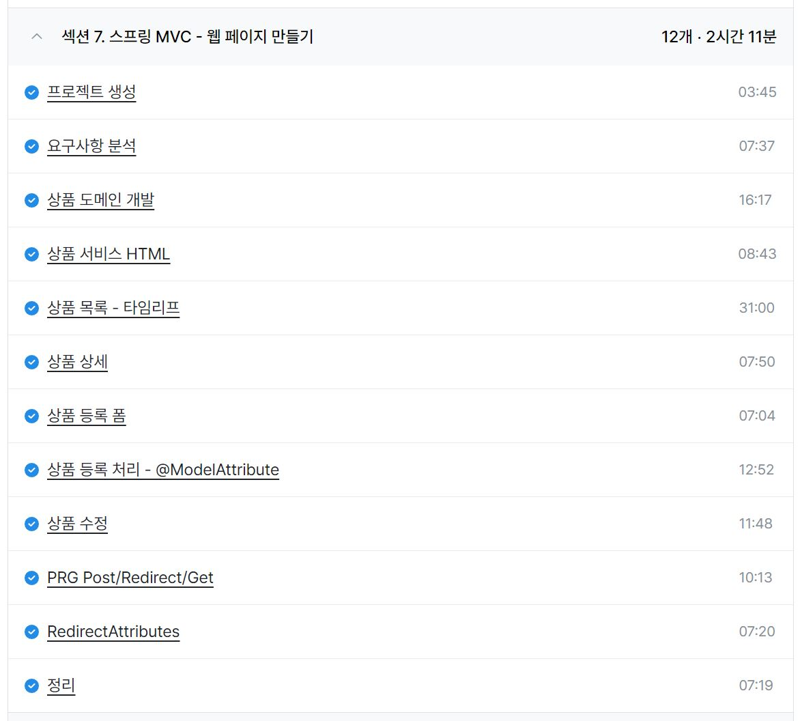
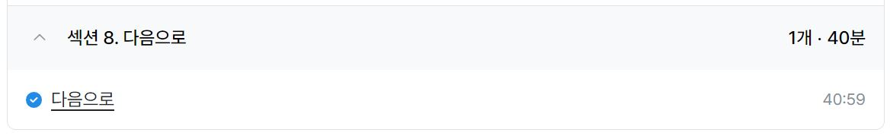

### 일일 알고리즘 학습

https://www.acmicpc.net/problem/11723

- 간단한 집합 구현 문재로 풀이자체는 무난했는데 수행 시간이 잘 푼 사람들에 비해 엄청 많이 나왔다. 나중에 한번 더 풀어보고 문제점을 찾아보면 좋을 듯
- 생성자에 List.of()를 넣는 방식으로 집합을 초기화했는데 자바 8에서는 지원하지 않는 문법인거 같아서 자바 11로 채점했다. 자바 버전별 차이에 대해서도 간단하게 학습하면 좋을 듯

ref : https://github.com/FickleBoBo/Algorithm_WorkSpace/tree/master/month_08/src/day_09

---

### 프로젝트 : QA 및 리턴제로 AI와 OpenVidu 학습

- 다음 주 QA 전 테스트를 팀원들과 진행하고 컨설턴트님과 상담 받았다.
- 테스트 과정에서 피드백에 문제가 있어서 디버깅이 좀 걸렸는데 피드백만 해결하니 모든 기능이 잘 작동해서 엄청 뿌듯했다.
- 상담 반응으로는 무난하게 수행한 프로젝트는 되는거 같았고 QA 만 무난히 통과하면 괜찮을 거 같다.
- 리턴제로 AI의 경우 요청에 보낼 파일이나 스트림을 준비하는게 생각보다 어려워서 오늘도 해결을 못했다.
- 주말까지 오픈비두에서 파일이나 스트림을 받는 방식을 먼저 시도해보고 안되면 클라이언트에서 파일이나 스트림을 받는 방식을 해보고 안되면 포기할듯

---

### 인프런 - 스프링 MVC 1편 - 백엔드 웹 개발 핵심 기술

- 섹션 7. 스프링 MVC - 웹 페이지 만들기 (2h 11m)
- 섹션 8. 다음으로 (40m)

- 스프링 MVC 1편의 간단한 프로젝트 파트로 앞의 내용을 잘 이해했으면 그냥 무난한 수준
- PRG 패턴에 대한 이해가 중요해보였는데 서버 사이드 렌더링 프로젝트여서 처음에 잘 이해가 안됐는데 클라이언트 사이드 렌더링도 POST fetch 요청 이후 navigater로 이동시키는게 사실상 PRG 패턴과 유사한 것 같아서 본능적으로 잘하고 있었던 것 같다. 다만 CSR은 뒤로가기가 가능해서 이점에 대한 테스트는 해봐야할듯
- 다음 강의는 바로 JPA를 듣는 야생형 스타일로 가야겠다.

ref : https://github.com/FickleBoBo/Inflearn

---
