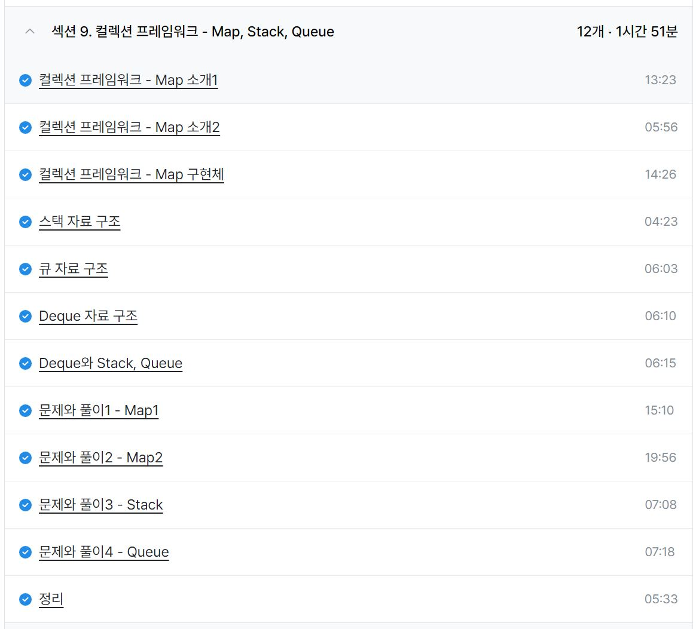
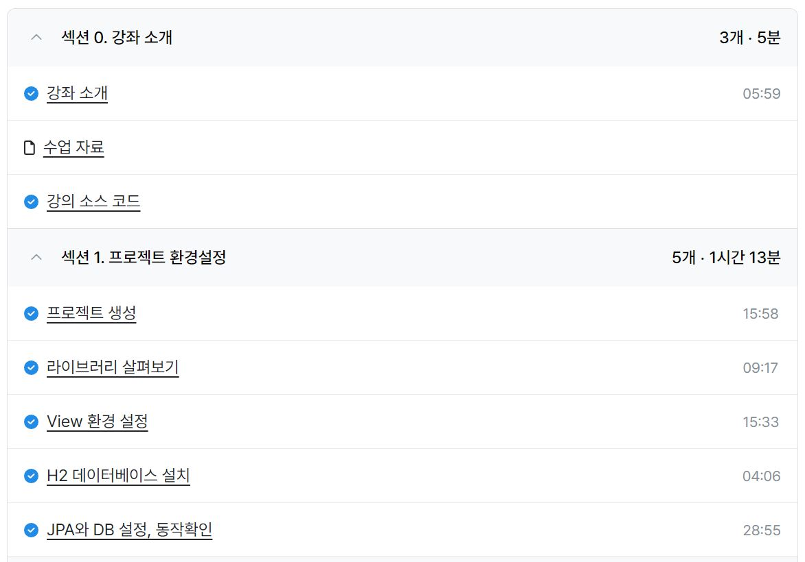
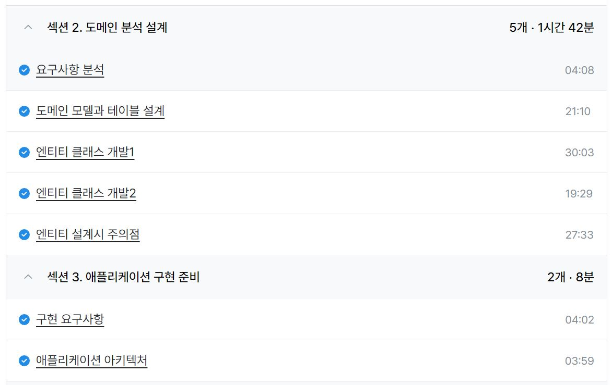

### 인프런 - 김영한의 실전 자바 - 중급 2편

- 섹션 9. 컬렉션 프레임워크 - Map, Stack, Queue (1h 51m)

---

- Vector가 성능이 안좋아서 안쓴다는 것은 알았는데 Stack이 Vector를 상속 받는 클래스임에도 Stack의 성능에 대한 의심을 하지 않았었는데 Deque를 Stack으로 사용할 것을 권장하는 것이 가장 크게 얻어갈 점이었다.
- ArrayDeque는 배열 기반 구현 정도로 알고 있어서 환형 배열 방식으로 구현됐을 것 같았는데 역시 그랬다.
- Set의 경우 Map과 유사한 것은 알았는데 아예 Map을 기반으로 구현된 줄은 몰랐다. Map으로 구현됐음에도 Map을 상속받지는 않는다는 점도 공부해볼만 한 것 같다.
- Map의 경우 entry의 개념도 새로웠는데 다른 언어처럼 키와 밸류 쌍을 자바에서도 다룰 수 있다는 점은 생각하지 못해서 신기했다.

ref : https://github.com/FickleBoBo/Inflearn

---

### 일일 알고리즘 학습 및 블로그 포스팅

https://www.acmicpc.net/problem/16398

https://mwzz6.tistory.com/entry/%EB%B0%B1%EC%A4%80-16398%EB%B2%88-%ED%96%89%EC%84%B1-%EC%97%B0%EA%B2%B0-Java

- 간단한 크루스칼 알고리즘 문제로 구현만 할 줄 알면 5분컷이다.
- 간선 배열을 통한 크루스칼 알고리즘에서 우선순위 큐가 더 성능이 좋은 것 같아서 바꿔서 사용했는데 간선 배열의 정렬과 우선순위 큐 중 뭐가 더 빠른지에 대한 분석은 필요할 것 같다. 추가로 트리셋과 전위 순회를 활용한 크루스칼도 해보며 비교해봐야겠다.

https://www.acmicpc.net/problem/27866

https://mwzz6.tistory.com/entry/%EB%B0%B1%EC%A4%80-27866%EB%B2%88-%EB%AC%B8%EC%9E%90%EC%99%80-%EB%AC%B8%EC%9E%90%EC%97%B4-Java

- 간단한 구현 문제

https://www.acmicpc.net/problem/2743

https://mwzz6.tistory.com/entry/%EB%B0%B1%EC%A4%80-2743%EB%B2%88-%EB%8B%A8%EC%96%B4-%EA%B8%B8%EC%9D%B4-%EC%9E%AC%EA%B8%B0-Java

- 간단한 구현 문제

https://www.acmicpc.net/problem/15439

https://mwzz6.tistory.com/entry/%EB%B0%B1%EC%A4%80-15439%EB%B2%88-%EB%B2%A0%EB%9D%BC%EC%9D%98-%ED%8C%A8%EC%85%98-Java

- 간단한 구현 문제

ref : https://github.com/FickleBoBo/Algorithm_WorkSpace/tree/master/month_08/src/day_10

ref : https://github.com/FickleBoBo/Tistory/tree/master/2024-08/src/day_10

---

### 인프런 - 실전! 스프링 부트와 JPA 활용1 - 웹 애플리케이션 개발

- 섹션 0. 강좌 소개 (5m)
- 섹션 1. 프로젝트 환경설정 (1h 13m)
- 섹션 2. 도메인 분석 설계 (1h 42m)
- 섹션 3. 애플리케이션 구현 준비 (8m)

---

- 야생형 로드맵으로 JPA 실전편 선수강
- 이해되는 부분이 거의 없지만 JPA는 DB 설계가 엄청나게 중요한 것 같다
- 반가운 어노테이션도 있었는데 처음보는 것도 많고 일반 관계형 데이터베이스랑은 약간 다른 것 같아서 학습할 분량이 많을 것으로 보인다
- N + 1 문제랑 쿼리 튜닝은 확실히 배워가야할듯

ref : https://github.com/FickleBoBo/Inflearn

---

### 프로젝트 : QA

- 금요일에 파트를 나눠 QA 및 소소한 코드 개선을 진행하기로 해서 오늘 맡은 파트에 대한 수정 및 커밋 진행
