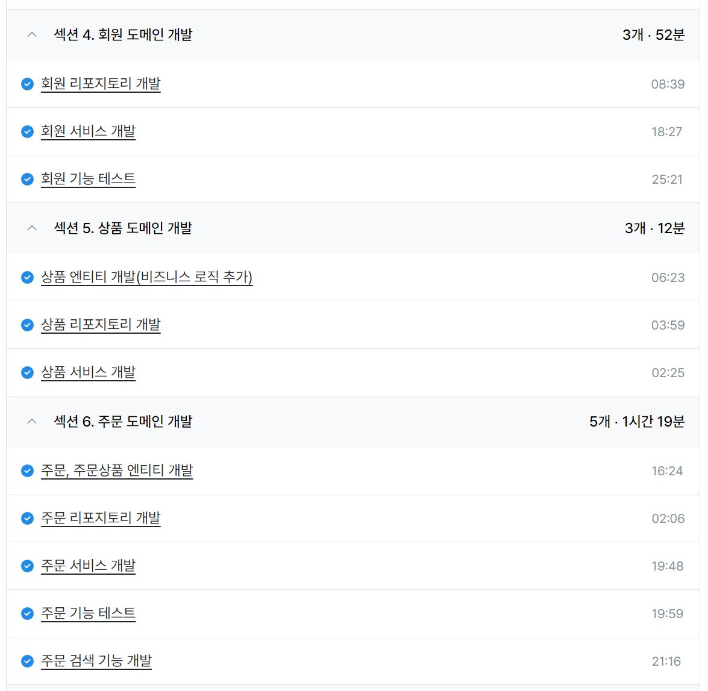
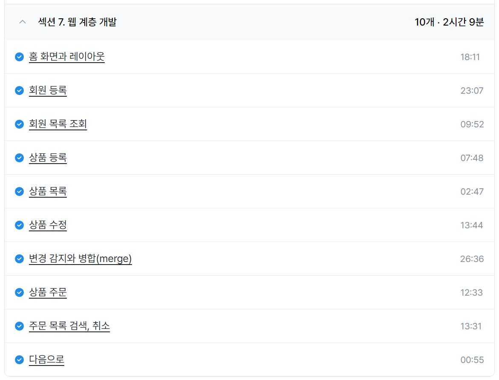

### 인프런 - 실전! 스프링 부트와 JPA 활용1 - 웹 애플리케이션 개발

- 섹션 4. 회원 도메인 개발 (52m)
- 섹션 5. 상품 도메인 개발 (12m)
- 섹션 6. 주문 도메인 개발 (1h 19m)
- 섹션 7. 웹 계층 개발 (2h 9m)

---

- JPA를 활용한 간단한 쇼핑몰 프로젝트의 흐름 학습
- 스프링에 대한 기본기가 있는 상태라면 JPA의 개념만 잘 학습하면 무리없이 진행할 수 있을 것으로 보였다.
- JPA는 개념이 거의 전부인 것 같고 개념을 바탕으로 꼼꼼한 DB 설계를 해야 스무스하게 개발이 가능할 것으로 보였다.
- 학습할 내용은 많아 보이는데 알고 나면 별거 아닐 것 같다.

ref : https://github.com/FickleBoBo/Inflearn

---

### 일일 알고리즘 학습 및 블로그 포스팅

https://www.acmicpc.net/problem/11004

- 실버 5치고 많이 어려운 문제였다. Arrays.sort와 우선순위 큐, 카운팅 정렬은 시간초과가 나서 우선순위 큐에서 큐의 크기를 조절하는 테크닉으로 겨우 통과했다.
- 다른 사람들보다 시간 소모가 많아서 찾아봤는데 퀵 셀렉션 알고리즘을 사용하는 걸 의도한 문제였던거 같다.
- 직접 퀵정렬을 구현하는 것보다 자바 내장 정렬이 더 빠르다고 생각해서 이걸 2초안에 어떻게 푸나 싶었는데 알고리즘 아이디어는 약간 신기했다.
- 퀵정렬도 구현이 어려워서 퀵정렬 먼저 구현 연습을 하고 이후 퀵 셀렉션을 연습해보면 좋을 것 같다.
- 추가로 Arrays.sort는 더블 피벗 퀵정렬이고 Collections.sort는 병합정렬을 기반으로 구현됐다고 하는데 둘에 대해서도 꼼꼼히 공부해봐야겠다.

https://www.acmicpc.net/problem/1269

https://mwzz6.tistory.com/entry/%EB%B0%B1%EC%A4%80-1269%EB%B2%88-%EB%8C%80%EC%B9%AD-%EC%B0%A8%EC%A7%91%ED%95%A9-Java

- 집합의 개념을 활용하면 간단하게 해결할 수 있는 문제로 set을 이용하면 쉽게 해결 가능

https://www.acmicpc.net/problem/7785

https://mwzz6.tistory.com/entry/%EB%B0%B1%EC%A4%80-7785%EB%B2%88-%ED%9A%8C%EC%82%AC%EC%97%90-%EC%9E%88%EB%8A%94-%EC%82%AC%EB%9E%8C-Java

- 간단한 set 문제
- 저번 주 성진이 문제에서 컬렉션 생성자에 컬렉션과 컴퍼레이터를 같이 넣을 수 없는게 이 문제도 똑같이 떠올라서 GPT에 물어봤는데 코드가 모호하게 해석될 여지가 있어서 생성자에 두 가지 옵션을 한번에 넣는 걸 자바에서 제공하지 않는다 정도의 답변을 받았다.

https://www.acmicpc.net/problem/2693

https://mwzz6.tistory.com/entry/%EB%B0%B1%EC%A4%80-2693%EB%B2%88-N%EB%B2%88%EC%A7%B8-%ED%81%B0-%EC%88%98-Java

- 아주 쉬운 구현 문제

https://www.acmicpc.net/problem/11728

https://mwzz6.tistory.com/entry/%EB%B0%B1%EC%A4%80-11728%EB%B2%88-%EB%B0%B0%EC%97%B4-%ED%95%A9%EC%B9%98%EA%B8%B0-Java

- 큐를 활용한 투 포인터 문제

https://www.acmicpc.net/problem/6996

https://mwzz6.tistory.com/entry/%EB%B0%B1%EC%A4%80-6996%EB%B2%88-%EC%95%A0%EB%84%88%EA%B7%B8%EB%9E%A8-Java

- 간단한 애너그램 문제

https://www.acmicpc.net/problem/11536

https://mwzz6.tistory.com/entry/%EB%B0%B1%EC%A4%80-11536%EB%B2%88-%EC%A4%84-%EC%84%B8%EC%9A%B0%EA%B8%B0-Java

- 간단한 구현 문제인데 String 클래스에서 제공하는 compareTo가 -1, 0, 1 을 반환하는 줄 알았는데 그냥 int 형 값을 알아서 반환한다는 점을 처음 알았다.
- compare과 compareTo를 잠깐 찾아보는게 좋을 것 같다.

https://www.acmicpc.net/problem/8979

https://mwzz6.tistory.com/entry/%EB%B0%B1%EC%A4%80-8979%EB%B2%88-%EC%98%AC%EB%A6%BC%ED%94%BD-Java

- 정렬을 해도 되고 안해도 되는 간단한 구현 문제
- 최적화는 조금 어려운거 같다.

https://www.acmicpc.net/problem/10815

https://mwzz6.tistory.com/entry/%EB%B0%B1%EC%A4%80-10815%EB%B2%88-%EC%88%AB%EC%9E%90-%EC%B9%B4%EB%93%9C-Java

- Set과 이분 탐색 모두 활용할 수 있는 문제로 간만에 자바 내장 메서드인 binarySearch를 활용해봤다.

https://www.acmicpc.net/problem/10816

https://mwzz6.tistory.com/entry/%EB%B0%B1%EC%A4%80-10816%EB%B2%88-%EC%88%AB%EC%9E%90-%EC%B9%B4%EB%93%9C-2-Java

- 1학기때 나를 괴롭혔던 문제 원톱 숫자 카드 2를 다시 만났다.
- Map과 매개변수 이분탐색 두 가지 방법으로 풀었는데 맵이 간단하고 정석적인 방법이고 매개변수 이분탐색은 간만에 구현하려니까 시간이 좀 걸렸다.
- 일단 코드 먼저 외우고 동작 원리는 꼼꼼히 다시 공부해보는게 좋을 것 같다.

https://www.acmicpc.net/problem/2473

https://mwzz6.tistory.com/entry/%EB%B0%B1%EC%A4%80-2473%EB%B2%88-%EC%84%B8-%EC%9A%A9%EC%95%A1-Java

- 두 용액 문제의 업글 버전으로 이전에 세하 개인 문제였다.
- 처음엔 못풀어서 알고리즘 스터디에서 설명을 들었는데 그냥 for문 내에서 투 포인터 돌려도 시간복잡도가 충분하다는 점을 놓쳐서 약간 허무했었는데 다시 해보니 투 포인터 자체도 쉽지는 않았다.
- 테스트 케이스 39%에서 막혀서 반례를 봤는데 타입 캐스팅을 해줬다고 생각했는데 CCW 알고리즘 문제 풀 때 타입 캐스팅 실수를 디버깅 해줬는데 이번엔 내가 실수르 했었다.

ref : https://github.com/FickleBoBo/Algorithm_WorkSpace/tree/master/month_08/src/day_15

ref : https://github.com/FickleBoBo/Tistory/tree/master/2024-08/src/day_15

---
